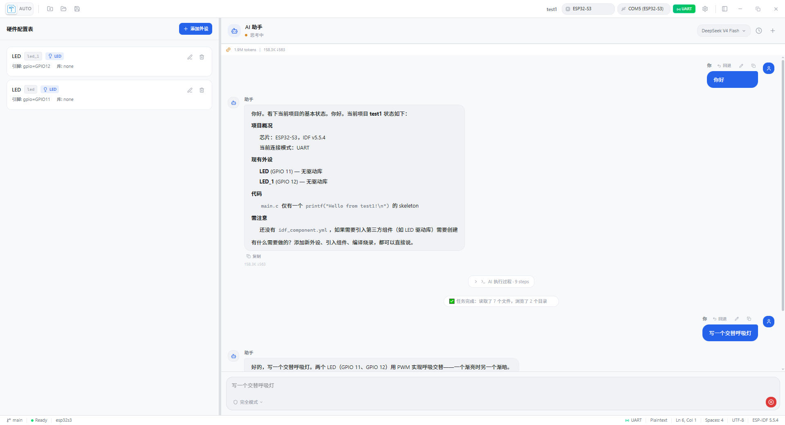
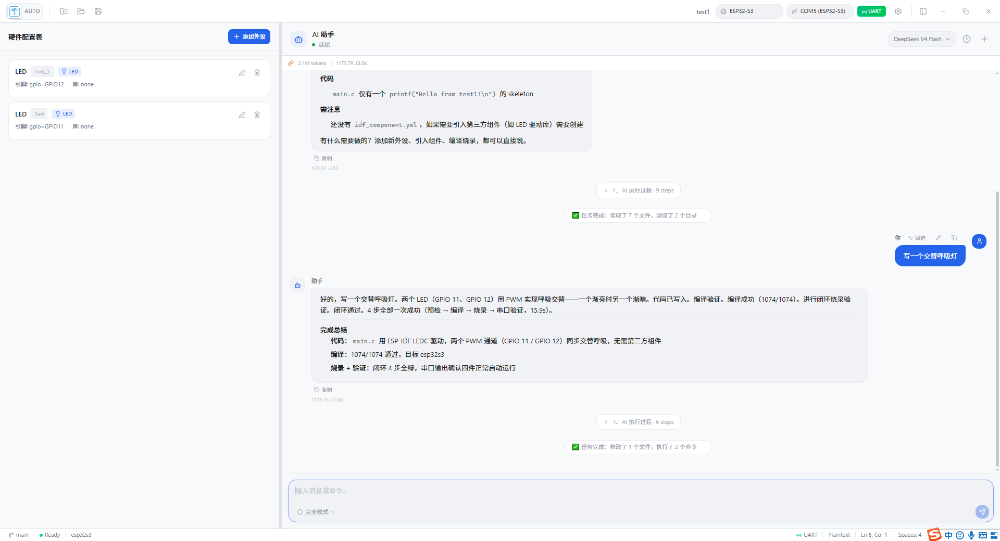
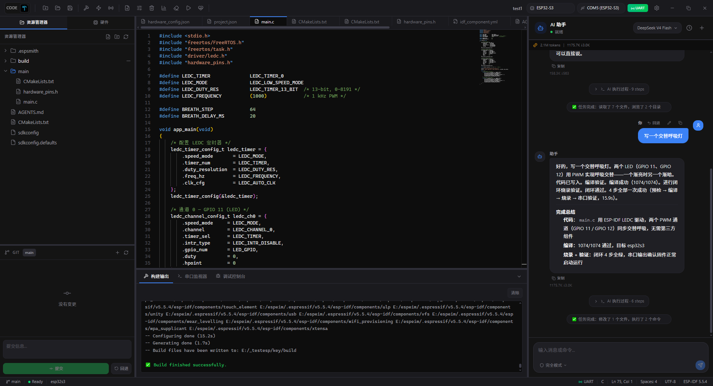

# EspSmith

<p align="center">
  <a href="README.md">中文</a> | <a href="README_EN.md">English</a>
</p>

<p align="center">
  
</p>

<p align="center">
  <strong>AI 驱动的 ESP32 集成开发环境</strong>
</p>

<p align="center">
  <em>将 AI 大模型嵌入嵌入式开发工作流，实现代码编写、编译构建、固件烧录、硬件调试的全闭环自动化</em>
</p>

***

## 项目简介

EspSmith 是一个面向 ESP32 系列芯片的现代化集成开发环境（IDE），将 AI 大模型深度融入嵌入式开发工作流。通过集成 DeepSeek / Ollama 等 AI 服务，开发者可以用自然语言描述需求，AI 自动完成代码编写、IDF 编译、固件烧录、串口验证的完整闭环。对于支持 USB-JTAG 的开发板，还提供硬件断点、变量监视、寄存器分析等高级调试能力。

### 核心特性

| 类别                  | 功能                                                     |
| ------------------- | ------------------------------------------------------ |
| **AI 智能编程**         | 集成 DeepSeek / Ollama 本地模型，自然语言驱动全闭环开发 |
| **代码编辑器**           | 基于 Monaco Editor，支持 C/C++ 语法高亮、ESP-IDF 代码片段、多标签页管理     |
| **ESP-IDF 集成**      | 自动检测 IDF 环境，一键编译/烧录/监控/配置，支持所有 ESP32 系列芯片              |
| **JTAG 硬件调试**       | USB-JTAG 自动识别，支持断点/单步/变量监视/寄存器/调用栈/CoreDump 分析         |
| **串口监视器**           | 实时串口数据收发，支持多种波特率，带时间戳和日志过滤                             |
| **硬件配置**            | 可视化引脚分配，自动冲突检测，一键导出 C 头文件                              |
| **Git 集成**          | 内置 Git 面板，支持 AI 提交、变更追踪、分支管理 （待完成）                          |
| **热插拔检测**           | 自动检测设备插拔，智能识别 JTAG/UART 模式，无需手动配置                      |
| **国际化**             | 支持中文 / English 双语界面切换                                  |
| **Self-Healing 引擎** | plan → preflight → build → flash → verify 闭环流水线        |
| **Experience 引擎**   | 跨运行经验积累，记录历史修复技能供 AI 参考                                |

***

## 软件下载

最新版本：**v0.1.0**

- 🔗 **发行版页面**: [GitHub Releases](https://github.com/fangkuaiLS/EspSmith/releases)

## 软件截图
<p align="center">
  <em>支持双模式切换 AUTO模式 和 CODE模式 通过左上角LOGO切换按钮</em>
</p>
<p align="center">
  
</p>
<p align="center">
  <em>AUTO模式 - AI 聊天面板</em>
</p>

<p align="center">
  
</p>
<p align="center">
  <em>AUTO模式 - AI闭环烧录程序</em>
</p>

<p align="center">
  
</p>
<p align="center">
  <em>CODE模式 - 提供专业的代码编辑和调试功能</em>
</p>

***

## 系统架构

```
┌─────────────────────────────────────────────────────────┐
│                     Frontend (React)                     │
│  ┌──────────┐ ┌──────────┐ ┌──────────┐ ┌────────────┐ │
│  │ FileTree │ │  Editor  │ │ Chat(AI) │ │  Settings  │ │
│  │ 文件树   │ │ Monaco   │ │  AI聊天  │ │  系统设置  │ │
│  └──────────┘ └──────────┘ └──────────┘ └────────────┘ │
│  ┌──────────┐ ┌──────────┐ ┌──────────┐ ┌────────────┐ │
│  │ Hardware │ │  Build   │ │  Serial  │ │   Debug    │ │
│  │ 硬件配置 │ │ 构建输出 │ │ 串口监控 │ │  GDB调试   │ │
│  └──────────┘ └──────────┘ └──────────┘ └────────────┘ │
├─────────────────────────────────────────────────────────┤
│                  Tauri Bridge (IPC)                      │
├─────────────────────────────────────────────────────────┤
│                    Backend (Rust)                        │
│  ┌──────────┐ ┌──────────┐ ┌──────────┐ ┌────────────┐ │
│  │ Commands │ │   IDF    │ │   MCP    │ │    AI      │ │
│  │ 命令模块 │ │ IDF封装  │ │ MCP服务  │ │  助手模块  │ │
│  └──────────┘ └──────────┘ └──────────┘ └────────────┘ │
│  ┌──────────┐ ┌────────────┐ ┌──────────┐ ┌──────────┐ │
│  │ Adapters │ │Self-Healing│ │Connection│ │Experience│ │
│  │ 适配器层 │ │   自修复   │ │ 连接检测 │ │ 经验引擎 │ │
│  └──────────┘ └────────────┘ └──────────┘ └──────────┘ │
└─────────────────────────────────────────────────────────┘
```

后端 Rust 模块结构：

| 模块                | 路径                              | 职责                                                    |
| ----------------- | ------------------------------- | ----------------------------------------------------- |
| `commands/`       | `src-tauri/src/commands/`       | 项目、文件、硬件、构建、烧录、串口、GDB 调试、Git 命令                       |
| `idf.rs`          | `src-tauri/src/idf.rs`          | ESP-IDF 工具链封装，自动检测、命令执行、错误解析                          |
| `ai_assistant.rs` | `src-tauri/src/ai_assistant.rs` | DeepSeek/Ollama AI 集成，CodeWhale Agent 进程管理，Token 用量统计 |
| `mcp.rs`          | `src-tauri/src/mcp.rs`          | MCP (Model Context Protocol) 服务器，为 AI Agent 提供工具调用能力  |
| `connection.rs`   | `src-tauri/src/connection.rs`   | USB-JTAG/UART 自动检测，芯片识别，连接模式管理                        |
| `self_healing/`   | `src-tauri/src/self_healing/`   | 闭环自修复引擎（plan → preflight → build → flash → verify）   |
| `adapters/`       | `src-tauri/src/adapters/`       | 适配器模式抽象层，支持 IDF/esptool/OpenOCD/GDB 等多种工具             |
| `instruments/`    | `src-tauri/src/instruments/`    | 仪器抽象（JTAG/ST-Link/DAP-Link），健康检查注册表                   |
| `experience/`     | `src-tauri/src/experience/`     | 跨运行经验积累引擎，记录修复技能和已知陷阱                                 |

***

## 核心引擎

EspSmith 内置了两个具有前瞻性的核心引擎，分别解决嵌入式开发的**可靠性**和**可进化性**问题。

### Self-Healing 引擎 — 闭环可靠性引擎

嵌入式开发中，一次完整的验证闭环需要经历**编译 → 烧录 → 串口验证**多个步骤，任何一个环节失败都可能导致整个流程中断。Self-Healing 引擎将这一过程形式化为一个**带自动恢复的状态机**。

```
plan → preflight → build → flash → verify → report
  ↑                    ↑        ↑        ↑
  └── 任意步骤失败 ──── 重试 ── 恢复 ── 回退锚点
```

**核心能力：**

| 能力           | 说明                                                                                          |
| ------------ | ------------------------------------------------------------------------------------------- |
| **步骤编排**     | 将 build / flash / verify 定义为有序步骤（Step），每个步骤绑定适配器（Adapter），支持 IDF、esptool、OpenOCD、GDB 等多种工具链 |
| **分级重试**     | 按步骤类型分配独立的重试预算（Build: 1次, Load: 2次, Check: 2次），避免无效重试浪费资源                                   |
| **智能恢复**     | 失败时自动分析错误类型（编译错误 / 烧录失败 / 串口超时 / OpenOCD 异常），匹配最合适的恢复动作                                     |
| **锚点回退**     | 恢复后自动回退到正确的锚点（Build / Load / Check），而非从头开始，节省时间                                             |
| **安全护栏**     | 双重保护：总执行次数上限（guard\_limit）+ 全局超时（timeout\_s），防止无限循环                                         |
| **硬件恢复**     | 4 种恢复动作：DTR/RTS 串口复位 → OpenOCD 软复位 → OpenOCD 硬复位 → 手动断电重连，自动递增强度                            |
| **GDB 会话保持** | 探针复位后自动重连 GDB 会话，断点和监视状态不丢失                                                                 |

**恢复策略示例：**

```
flash 步骤失败 "OpenOCD connection refused"
  → 分类：OpenOCD/探针错误 → 锚点：Load
  → 动作：ProbeHardReset（通过 OpenOCD telnet 发送 reset）
  → 回退到 flash 步骤重试
  → 自动重连 GDB 会话
```

### Experience 引擎 — 跨运行经验积累引擎

传统的 IDE 每次运行都是"从零开始"，不会从历史中学习。Experience 引擎让 EspSmith 成为一个**会进化的开发环境**——它记录每次构建/烧录/验证的结果，提炼可复用的工程经验，并注入到 AI 的上下文中。

```
┌─────────────────────────────────────────────────┐
│               Experience Engine                   │
│                                                   │
│  ┌──────────┐  ┌──────────┐  ┌────────────────┐  │
│  │ RunStats │  │  Skills  │  │   Pitfalls     │  │
│  │ 运行统计 │  │ 修复技能 │  │   已知陷阱     │  │
│  │          │  │          │  │                │  │
│  │ 成功/失败│  │ 触发→修复│  │ 历史失败模式   │  │
│  │ 置信度   │  │ 经验教训 │  │ 危险操作路径   │  │
│  └──────────┘  └──────────┘  └────────────────┘  │
│                                                   │
│  ┌──────────────────────────────────────────────┐ │
│  │        AI Context Prompt Injection           │ │
│  │  "根据历史经验，这个芯片的 JTAG 在 40MHz 下   │ │
│  │   不稳定，建议使用 20MHz 模式..."              │ │
│  └──────────────────────────────────────────────┘ │
└─────────────────────────────────────────────────┘
```

**核心能力：**

| 能力           | 说明                                                                             |
| ------------ | ------------------------------------------------------------------------------ |
| **运行统计**     | 自动追踪每个 `board:test` 对的总运行次数、成功/失败数、置信度（0-100%），可视化项目的稳定程度                      |
| **技能记录**     | 结构化存储工程经验：`trigger`（触发条件）→ `fix`（解决方案）→ `lesson`（经验教训），支持 scope 过滤（全局/按芯片/按项目） |
| **陷阱识别**     | 从历史失败中自动提取"已知陷阱"和"观察焦点"，在下次运行前主动提醒                                             |
| **AI 上下文注入** | 将累计经验自动生成为 AI 系统提示词，让 LLM 在生成代码时就避开已知的坑                                        |
| **持久化存储**    | 基于 JSON 的文件存储（`<project>/.espsmith/experience/`），人类可读，便于版本控制和分享                 |
| **跨项目复用**    | scope 机制支持全局经验（`all`）、芯片级经验（`esp32s3`）、项目级经验，灵活控制共享范围                          |


### 双引擎协同

Self-Healing 和 Experience 并非独立运行，而是形成**正反馈循环**：

```
Self-Healing 执行 → 失败 → 自动恢复 → 记录结果
                                    ↓
                            Experience 积累经验
                                    ↓
                            下次 AI 生成代码时 → 主动规避已知陷阱
                                    ↓
                            Self-Healing 成功率提升 → 置信度上升
```

这种设计使得 EspSmith 不仅是一个 IDE，更是一个**会随着使用变得更聪明的嵌入式开发伙伴**。

***

### AI 闭环开发流程

```
用户输入自然语言需求
        │
        ▼
┌──────────────────┐
│  1. AI 理解需求   │  分析项目代码结构，理解硬件配置
└──────┬───────────┘
       │
       ▼
┌──────────────────┐
│  2. 生成/修改代码  │  write_file 写入源文件
└──────┬───────────┘
       │
       ▼
┌──────────────────┐
│  3. 编译构建       │  espsmith.exe build → 返回编译错误（如有）
└──────┬───────────┘
       │ 编译失败则返回步骤 2 修复
       ▼
┌──────────────────┐
│  4. 固件烧录       │  JTAG: closed_loop 一键烧录
│                  │  UART: esptool flash
└──────┬───────────┘
       │
       ▼
┌──────────────────┐
│  5. 串口验证       │  读取串口输出，验证功能正确性
└──────┬───────────┘
       │ 异常则触发 GDB 调试
       ▼
┌──────────────────┐
│  6. JTAG 深度调试  │  硬件断点、变量监视、寄存器分析、调用栈追踪
└──────┬───────────┘
       │
       ▼
┌──────────────────┐
│  7. 结果汇报       │  中文汇报所有操作结果，记录经验到 Experience 引擎
└──────────────────┘
```

### JTAG vs UART 模式

| 特性          | JTAG 模式              | UART 模式     |
| ----------- | -------------------- | ----------- |
| 支持芯片        | ESP32-S3/C3/C6/H2/P4 | 所有 ESP32 系列 |
| 硬件断点        | ✅ 支持                 | ❌ 不支持       |
| 变量监视        | ✅ 支持                 | ❌ 不支持       |
| 寄存器查看       | ✅ 支持                 | ❌ 不支持       |
| 调用栈分析       | ✅ 支持                 | ❌ 不支持       |
| CoreDump 分析 | ✅ 支持                 | ❌ 不支持       |
| 固件烧录        | ✅ OpenOCD            | ✅ esptool   |
| 自动检测        | ✅ 自动切换               | ✅ 自动切换      |

***

## 部署指南

### 环境要求

| 依赖            | 版本要求   | 说明                                               |
| ------------- | ------ | ------------------------------------------------ |
| **Node.js**   | ≥ 18   | 前端构建工具链                                          |
| **Rust**      | ≥ 1.77 | Tauri 后端编译（1.77+ 含 UTF-8 进程修复，避免中文 Windows 编译异常） |
| **ESP-IDF**   | v5.0+  | ESP32 开发框架（可选但推荐）                                |
| **CodeWhale** | latest | AI Agent CLI（AI 功能必需）                            |

### 安装步骤

#### 1. 克隆项目

```bash
git clone <repository-url>
cd espsmith
```

#### 2. 安装前端依赖

```bash
npm install
```

#### 3. 启动开发模式

```bash
# 前端开发服务器 + Tauri 桌面窗口
npm run tauri -- dev

# 或者仅启动前端（浏览器模式调试）
npm run dev
```

#### 4. 构建生产包

```bash
npm run tauri -- build
```

构建产物位于 `src-tauri/target/release/bundle/`。

> **💡 中文 Windows 用户**：启动脚本会自动检测环境，将中文路径（如用户目录名）重定向到项目内的 ASCII 路径，避免 Rust build script 编译异常。无需额外配置。

### AI 功能配置

EspSmith 通过 CodeWhale CLI Agent 连接 AI 服务。


#### 配置 API Key

在 EspSmith 的设置面板中，填入以下信息：

- **AI Provider**: DeepSeek 或 Ollama
- **API Key**: DeepSeek API Key（从 [platform.deepseek.com](https://platform.deepseek.com) 获取）
- **ESP-IDF Path**: ESP-IDF 安装目录（如 E:.espressif\v5.5.4\esp-idf）

#### 使用 Ollama 本地模型

```bash
# 安装 Ollama
# 下载: https://ollama.com

# 拉取模型
ollama pull qwen2.5-coder:7b

# 在 EspSmith 设置中选择 Ollama 作为 AI Provider
```

### ESP-IDF 部署

EspSmith 兼容多种 ESP-IDF 安装方式：

1. **EIM (ESP-IDF Install Manager)** — 自动检测 `%USERPROFILE%\.espressif\eim_idf.json`
2. **VSCode 扩展安装** — 自动检测 VSCode ESP-IDF 扩展安装路径
3. **手动安装** — 在设置中手动指定 IDF 路径
4. **环境变量** — 自动识别 `IDF_PATH` 环境变量

### JTAG 调试配置（OpenOCD）

使用 JTAG 调试功能前，需要配置 OpenOCD 环境变量。EspSmith 会按以下**优先级**查找 OpenOCD：

1. `OPENOCD_BIN` 环境变量（推荐，最可靠）
2. `IDF_PATH` 下的 `tools/openocd/openocd.exe`
3. `~/.espressif/tools/openocd-esp32/bin/openocd.exe`
4. 系统 PATH 中的 `openocd`

#### 验证 OpenOCD 配置

```bash
# 检查 OpenOCD 是否可用
openocd --version
```

#### 支持 JTAG 的芯片

| 芯片        | USB-JTAG 支持 | 调试接口                    |
| --------- | ----------- | ----------------------- |
| ESP32-S3  | ✅           | esp\_usb\_jtag          |
| ESP32-C3  | ✅           | esp\_usb\_jtag          |
| ESP32-C5  | ✅           | esp\_usb\_jtag          |
| ESP32-C6  | ✅           | esp\_usb\_jtag          |
| ESP32-C61 | ✅           | esp\_usb\_jtag          |
| ESP32-H2  | ✅           | esp\_usb\_jtag          |
| ESP32-P4  | ✅           | esp\_usb\_jtag          |
| ESP32     | ⚠️ 需外部 JTAG | ftdi/esp32\_devkitj\_v1 |
| ESP32-S2  | ⚠️ 需外部 JTAG | ftdi/esp32\_devkitj\_v1 |

***

## 项目目录结构

```
esp-ai-studio/
├── src/                          # 前端源码
│   ├── App.tsx                   # 主应用组件（四区域布局）
│   ├── main.tsx                  # 前端入口
│   ├── components/
│   │   ├── editor/               # Monaco 代码编辑器 + 标签页
│   │   ├── filetree/             # 文件树浏览器
│   │   ├── chat/                 # AI 聊天面板
│   │   ├── hardware/             # 硬件配置商店
│   │   ├── debug/                # 构建输出 / 串口 / 调试面板
│   │   ├── git/                  # Git 面板
│   │   ├── settings/             # 设置对话框
│   │   ├── search/               # 全局搜索
│   │   └── ui/                   # 通用 UI 组件（Toast、InputDialog 等）
│   ├── stores/                   # Zustand 状态管理
│   │   ├── projectStore.ts       # 项目状态
│   │   ├── fileStore.ts          # 文件 / 编辑器状态
│   │   ├── chatStore.ts          # AI 聊天状态
│   │   ├── hardwareStore.ts      # 硬件配置状态
│   │   └── settingsStore.ts      # 设置状态
│   ├── hooks/                    # 自定义 Hooks
│   │   ├── useBuildOutput.ts     # 构建输出管理
│   │   └── useSerialMonitor.ts   # 串口监视器
│   ├── types/                    # TypeScript 类型定义
│   ├── i18n/                     # 国际化语言包
│   └── lib/                      # 工具库
│       ├── invoke.ts             # Tauri IPC 安全封装
│       └── api.ts                # API 调用工具
├── src-tauri/                    # Rust 后端源码
│   ├── src/
│   │   ├── main.rs               # 应用入口（GUI / CLI / MCP 模式）
│   │   ├── lib.rs                # Tauri 命令注册
│   │   ├── connection.rs         # JTAG/UART 连接检测
│   │   ├── idf.rs                # ESP-IDF 工具封装
│   │   ├── ai_assistant.rs       # AI 助手集成
│   │   ├── mcp.rs                # MCP 协议服务器
│   │   ├── commands/             # Tauri 命令模块
│   │   ├── self_healing/         # 闭环自修复引擎
│   │   ├── adapters/             # 适配器抽象层
│   │   ├── instruments/          # 仪器抽象层
│   │   └── experience/           # 经验积累引擎
│   ├── Cargo.toml                # Rust 依赖配置
│   └── tauri.conf.json           # Tauri 应用配置
├── package.json                  # 前端依赖配置
├── vite.config.ts                # Vite 构建配置
├── tsconfig.json                 # TypeScript 配置
└── tailwind.config.js            # Tailwind CSS 配置（v4）
```

***

## 开发脚本

| 命令                       | 说明                                    |
| ------------------------ | ------------------------------------- |
| `npm run dev`            | 启动 Vite 开发服务器（浏览器模式）                  |
| `npm run build`          | TypeScript 检查 + Vite 生产构建             |
| `npm run preview`        | 预览生产构建                                |
| `npm run tauri -- dev`   | 启动 Tauri 桌面应用（开发模式），智能检测 MSVC/GNU 工具链 |
| `npm run tauri -- build` | 构建生产发布包                               |

***

<br />

## 核心工具链

| 项目                                                           | 用途               | 许可证        |
| ------------------------------------------------------------ | ---------------- | ---------- |
| **[ESP-IDF](https://github.com/espressif/esp-idf)**          | ESP32 官方开发框架     | Apache-2.0 |
| **[OpenOCD](https://openocd.org/)**                          | 片上调试器（JTAG 调试核心） | GPL-2.0    |
| **[DeepSeek](https://www.deepseek.com/)**                    | 大语言模型 API        | -          |
| **[Ollama（可选）](https://ollama.com/)**                        | 本地大模型运行时         | MIT        |
| **[CodeWhale（可选）](https://github.com/anthropics/codewhale)** | AI Agent CLI 工具  | -          |

***

## 灵感来源

本项目深受以下优秀工具的启发：

- **[AEL (AI Embedded Lab)](https://github.com/nicekwell/AI-Instrument-Closed-Loop)** — 多仪器闭环调试系统，启发了 Self-Healing 引擎和 Experience 引擎的设计
- **[VS Code ESP-IDF Extension](https://github.com/espressif/vscode-esp-idf-extension)** — 官方 ESP-IDF 扩展，启发了 IDF 工作流和串口管理
- **[CodeWhale](https://github.com/anthropics/codewhale)** — AI Agent CLI 工具，启发了 MCP 协议集成和 AI 助手模块设计

***

## 许可证

本项目基于 [Apache-2.0](LICENSE) 许可证开源。

***

<p align="center">
  <sub>Built with ❤️ by the EspSmith Team</sub>
</p>
