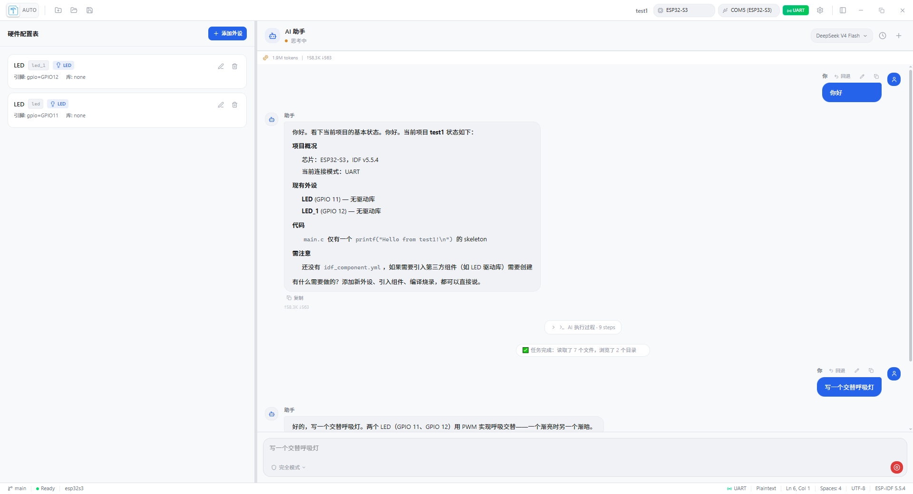
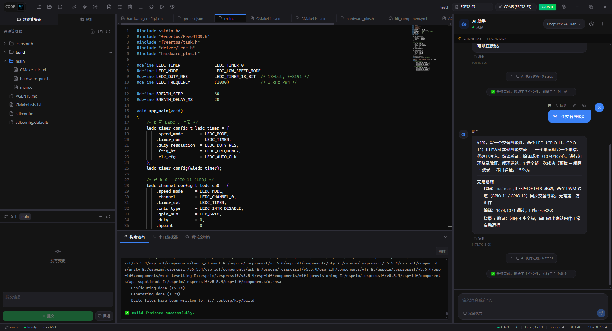

# EspSmith

<p align="center">
  <a href="README.md">中文</a> | <a href="README_EN.md">English</a>
</p>

<p align="center">
  
</p>

<p align="center">
  <strong>面向 ESP32 的 AI 原生集成开发环境</strong>
</p>

<p align="center">
  让代码生成、编译、烧录、串口验证、JTAG 调试进入同一个工作流。
</p>

<p align="center">
  <a href="https://github.com/fangkuaiLS/EspSmith/releases"></a>
  
  
  
</p>

---

## 项目简介

EspSmith 是一个围绕 **ESP32 / ESP-IDF** 构建的桌面 IDE，前端基于 **React + Monaco Editor**，后端基于 **Tauri + Rust**。  
它不是单纯把聊天窗口塞进编辑器里，而是把 AI 放进真实的嵌入式开发链路中：

- 读项目结构
- 修改或生成代码
- 调用 ESP-IDF 构建
- 烧录到开发板
- 读取串口结果
- 在支持的板卡上进入 JTAG 调试

目标很直接：把“写代码”和“让代码在板子上跑起来”之间的距离缩短。

## 为什么值得看

- **AI 不只会写代码**：它可以接入构建、烧录、验证和调试流程。
- **双工作模式**：既支持偏 AI 协作的 `AUTO` 模式，也支持偏 IDE 操作的 `CODE` 模式。
- **JTAG / UART 自动识别**：尽量减少手工切换和工具链拼接。
- **面向嵌入式闭环**：不仅关注“生成了什么代码”，也关注“代码是否真的运行正确”。
- **有持续演进空间**：内置 `Self-Healing` 与 `Experience` 两个引擎，目标是让工具越用越聪明。

---

## 核心能力

| 模块 | 能力 |
| --- | --- |
| AI 助手 | 集成 CodeWhale / MiMo-Code，支持自然语言驱动开发 |
| 编辑器 | 基于 Monaco Editor，支持 C/C++ 多标签编辑 |
| ESP-IDF 集成 | 一键构建、烧录、串口监视、环境检测 |
| JTAG 调试 | 断点、单步、变量、寄存器、调用栈、CoreDump 分析 |
| 串口监视器 | 实时日志、输入回传、波特率切换 |
| 硬件配置 | 图形化引脚分配、冲突检测、自动生成头文件 |
| Git 面板 | 查看状态、分支操作、面向 AI 变更的工作流入口 |
| 国际化 | 中文 / English 双语界面 |

---

## 截图

<p align="center">
  <em>左上角 Logo 可在 AUTO 与 CODE 两种工作模式之间切换</em>
</p>

<p align="center">
  
</p>

<p align="center">
  <em>AUTO 模式：更适合通过 AI 推动需求实现</em>
</p>

<p align="center">
  
</p>

<p align="center">
  <em>构建、烧录、验证尽量留在同一条链路里完成</em>
</p>

<p align="center">
  
</p>

<p align="center">
  <em>CODE 模式：更接近传统 IDE，但保留 AI 与调试能力</em>
</p>

---

## 适用场景

- 想用 AI 辅助做 ESP-IDF 项目开发，但不想频繁跳出 IDE
- 需要把“生成代码”快速推进到“板上验证”
- 使用支持 USB-JTAG 的 ESP32 板卡，希望直接进入硬件调试
- 想统一管理项目文件、硬件配置、串口、构建输出和 AI 记录

---

## 架构概览

```text
Frontend
  React + Monaco + Zustand
    ├─ FileTree / Editor / Chat / Hardware / Debug Panels
    └─ AUTO / CODE 双模式 UI

Bridge
  Tauri IPC

Backend
  Rust
    ├─ commands/        项目、文件、构建、烧录、串口、调试、Git
    ├─ idf.rs           ESP-IDF 工具链封装
    ├─ connection.rs    JTAG / UART 识别
    ├─ ai_assistant.rs  AI Provider 集成
    ├─ mcp.rs           MCP 工具调用
    ├─ self_healing/    闭环恢复引擎
    └─ experience/      经验积累引擎
```

### 后端模块职责

| 模块 | 路径 | 说明 |
| --- | --- | --- |
| `commands/` | `src-tauri/src/commands/` | 项目、文件、构建、烧录、串口、调试、Git 命令 |
| `idf.rs` | `src-tauri/src/idf.rs` | ESP-IDF 环境检测、命令执行、错误解析 |
| `connection.rs` | `src-tauri/src/connection.rs` | 识别设备连接方式与目标信息 |
| `ai_assistant.rs` | `src-tauri/src/ai_assistant.rs` | AI 会话、事件流、工具调用联动 |
| `mcp.rs` | `src-tauri/src/mcp.rs` | 为 AI 提供项目内工具能力 |
| `self_healing/` | `src-tauri/src/self_healing/` | plan -> preflight -> build -> flash -> verify |
| `experience/` | `src-tauri/src/experience/` | 记录运行经验与失败模式 |

---

## 两个关键引擎

### Self-Healing

`Self-Healing` 关注的是“失败后怎么办”。

它把嵌入式常见流程拆成一组可恢复的步骤：

```text
plan -> preflight -> build -> flash -> verify -> report
```

当构建失败、OpenOCD 异常、串口验证超时或调试链路中断时，它的目标不是简单报错退出，而是：

- 判断错误类型
- 选择恢复动作
- 回到正确锚点继续
- 尽量避免从头再来

### Experience

`Experience` 关注的是“下一次能不能更顺”。

它会积累项目运行中的一些经验信息，例如：

- 哪种板卡 / 链路组合更稳定
- 某类错误通常对应什么修复方式
- 哪些参数、步骤或模式容易出问题

这些经验未来可以反哺给 AI，让生成和执行策略更贴近真实硬件环境。

---

## JTAG 与 UART

| 对比项 | JTAG 模式 | UART 模式 |
| --- | --- | --- |
| 支持芯片 | 主要面向带 USB-JTAG 的 ESP32 芯片 | 全部 ESP32 系列 |
| 烧录方式 | OpenOCD | esptool |
| 硬件断点 | 支持 | 不支持 |
| 变量/寄存器观察 | 支持 | 不支持 |
| 调用栈分析 | 支持 | 不支持 |
| 自动识别 | 支持 | 支持 |

> 对于支持 USB-JTAG 的板卡，EspSmith 会尽量优先走更适合调试的路径。

---

## 快速开始

### 环境要求

| 依赖 | 建议版本 | 说明 |
| --- | --- | --- |
| Node.js | 18+ | 前端构建 |
| Rust | 1.77+ | Tauri 后端编译 |
| ESP-IDF | 5.0+ | 推荐安装 |
| CodeWhale | 最新版 | AI 功能可选依赖 |
| MiMo-Code | 最新版 | AI 功能可选依赖 |

### 1. 克隆项目

```bash
git clone https://github.com/fangkuaiLS/EspSmith.git
cd espsmith
```

### 2. 安装依赖

```bash
npm install
```

### 3. 启动开发模式

```bash
npm run tauri -- dev
```

如果只想启动前端页面：

```bash
npm run dev
```

### 4. 构建发行版本

```bash
npm run tauri -- build
```

构建产物位于：

```text
src-tauri/target/release/bundle/
```

> Windows 中文路径场景下，项目脚本会尽量规避 Rust / Tauri 在非 ASCII 路径上的常见构建问题。

---

## AI 配置

EspSmith 当前支持两类 AI 接入方式：

| Provider | 模型示例 | 特点 |
| --- | --- | --- |
| CodeWhale | `deepseek-v4-pro` / `deepseek-v4-flash` | 响应快，适合日常协作 |
| MiMo-Code | `mimo-auto` 等 | 支持多模型与工具调用 |

### 配置项

在设置面板中一般需要配置：

- `AI Provider`
- `Model`
- `ESP-IDF Path`
- 如果使用 DeepSeek 相关接口，还需要 `API Key`

---

## ESP-IDF 与 OpenOCD

### ESP-IDF 发现方式

EspSmith 会尝试从以下来源寻找 IDF：

1. EIM 安装信息
2. VS Code ESP-IDF 扩展安装路径
3. 手动配置路径
4. `IDF_PATH` 环境变量

### OpenOCD 查找优先级

1. `OPENOCD_BIN`
2. `IDF_PATH/tools/openocd/`
3. `~/.espressif/tools/openocd-esp32/`
4. 系统 `PATH`

验证方式：

```bash
openocd --version
```

---

## 项目结构

```text
espsmith/
├─ src/                     前端源码
│  ├─ components/           UI 组件
│  ├─ stores/               Zustand 状态管理
│  ├─ hooks/                自定义 Hook
│  ├─ lib/                  IPC / API / 工具方法
│  ├─ i18n/                 国际化资源
│  └─ App.tsx               主界面
├─ src-tauri/               Rust + Tauri 后端
│  ├─ src/
│  │  ├─ commands/          Tauri 命令
│  │  ├─ self_healing/      自恢复引擎
│  │  ├─ experience/        经验引擎
│  │  ├─ adapters/          工具适配层
│  │  ├─ mcp.rs             MCP 能力
│  │  ├─ ai_assistant.rs    AI 集成
│  │  └─ main.rs            入口
│  └─ tauri.conf.json
├─ docs/                    README 截图
├─ public/                  静态资源
└─ scripts/                 辅助脚本
```

---

## 开发命令

| 命令 | 说明 |
| --- | --- |
| `npm run dev` | 启动前端开发服务器 |
| `npm run build` | 执行 TypeScript 检查并构建前端 |
| `npm run preview` | 预览构建结果 |
| `npm run tauri -- dev` | 启动 Tauri 桌面开发模式 |
| `npm run tauri -- build` | 构建桌面发行包 |

---

## 依赖工具链

| 项目 | 用途 | 许可证 |
| --- | --- | --- |
| [ESP-IDF](https://github.com/espressif/esp-idf) | ESP32 官方开发框架 | Apache-2.0 |
| [OpenOCD](https://openocd.org/) | JTAG 调试链路 | GPL-2.0 |
| [CodeWhale](https://www.npmjs.com/package/codewhale) | AI Agent CLI | - |
| [MiMo-Code](https://github.com/mimocode/mimo-code) | AI Agent CLI | - |
| [DeepSeek](https://www.deepseek.com/) | 大模型能力来源之一 | - |

---

## 灵感来源

- [AEL (AI Embedded Lab)](https://github.com/EZ32Inc/ai-embedded-lab)
- [VS Code ESP-IDF Extension](https://github.com/espressif/vscode-esp-idf-extension)
- [CodeWhale](https://www.npmjs.com/package/codewhale)
- [MiMo-Code](https://github.com/mimocode/mimo-code)
- [ESP-IDF](https://github.com/espressif/esp-idf)

---

## 下载与发布

- 发布页：[GitHub Releases](https://github.com/fangkuaiLS/EspSmith/releases)

---

## License

本项目基于 [Apache-2.0](LICENSE) 开源。

<p align="center">
  <sub>Built by the EspSmith Team</sub>
</p>
